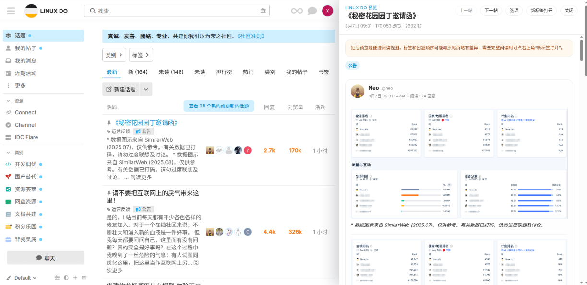
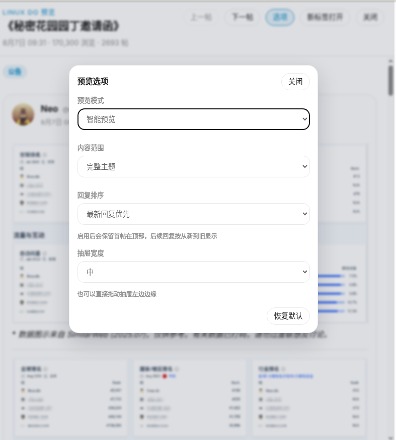

# Linux.do SidePeek

给 `https://linux.do` 里的主题链接加一个右侧抽屉预览：点击帖子标题后，不离开当前页面，右边直接展开内容。

## 当前功能

- 拦截站内主内容区里的主题链接点击，改为右侧抽屉预览
- 优先通过 Discourse 的 topic JSON 接口渲染内容
- 智能预览和整页模式都会按站点正常进帖的方式发起计数请求，尽量兼容论坛浏览计数
- 接口不可用时，自动回退为右侧 iframe 整页预览
- 支持在抽屉内直接回复主题或指定楼层，支持 Markdown，`Ctrl+Enter` / `Cmd+Enter` 快捷发送
- 支持无限滚动自动加载更多帖子；下滑接近底部会自动拉取后续回复，底部显示加载进度
- 支持抽屉内图片点击全屏放大预览；点击遮罩层、右上角关闭或按 `Esc` 可退出
- 带普通外链的图片仍按原链接打开；指向原图的图片链接会优先走抽屉内预览
- 支持右上角 `选项` 按钮弹出临时设置窗口
- 设置窗口支持切换：`预览模式`、`内容范围`、`回复排序`、`抽屉模式`、`抽屉宽度`
- 设置窗口支持 `关闭` 按钮、点击空白区域关闭、`Esc` 关闭
- 设置修改后会自动保存到本地，下次打开继续生效
- 支持拖动抽屉左边缘来自定义宽度（窄屏下可能不可用）
- 支持 `上一帖` / `下一帖` 快速浏览当前列表
- 支持 `Alt + ↑ / Alt + ↓` 快捷切换上一帖 / 下一帖
- 支持 `首帖 + 最新回复`：智能预览默认仍是正常顺序；切到这个模式后，首帖固定在顶部，长帖会优先显示最新一批回复
- 支持 `挤压模式` / `浮层模式` 两种抽屉模式；浮层模式下支持点击抽屉外区域关闭
- 支持在“首帖 + 最新回复”视图下手动刷新最新回复，刷新时尽量保留当前滚动位置
- 列表页“查看 x 个新的或更新的话题”提示条会固定在中间栏顶部区域，点击后更容易回顶刷新
- 抽屉内会为楼主回复显示 `Topic Owner` 标记，帮助快速识别楼主发言
- 每次页面加载后首次打开时会显示一次预览说明，提醒抽屉视图与原帖页可能略有差异
- 标签对象会自动提取可读名称，避免显示 `[object Object]`

## 设置面板预览

## 使用方式

1. 打开任意带主题链接的页面，例如首页、`/latest`、搜索页或用户发帖流
2. 点击任意主题标题，右侧抽屉会展开
3. 如需调整预览行为，点击右上角 `选项`
4. 如需完整原帖页，点击右上角 `新标签打开`
5. 如需关闭抽屉，按 `Esc` 或点击右上角 `关闭`

## 浏览计数验证

1. 在列表里找一个相对小众、当前浏览数较稳定的帖子
2. 先记下它在列表中的 `浏览` 数字
3. 用左键点标题，测试右侧抽屉的智能预览或整页模式
4. 停留几秒后回到列表，刷新看看 `浏览` 是否增长
5. 为避免数字乱跳，测试时尽量选同时在线人数少、别人不太会点开的帖子

## 预览选项

- `预览模式`
  - `智能预览`：通过 JSON 接口只拉取帖子内容，渲染更快、界面更干净，支持抽屉内回复和无限滚动
  - `整页模式`：以 iframe 嵌入论坛原帖页。内容与原帖 100% 一致——包括投票、嵌入、动态组件等智能预览无法还原的元素；也作为智能预览接口不可用时的降级方案。注意：整页模式下抽屉内回复不可用，浏览计数由 iframe 内页面自行处理
- `内容范围`
  - `完整主题`
  - `仅首帖`
- `回复排序`
  - `默认顺序`（智能预览默认）
  - `首帖 + 最新回复`（长帖下优先显示最新一批回复，不代表整帖一次性完整倒序）
- `抽屉模式`
  - `挤压模式` / `浮层模式`
  - 浮层模式下点击抽屉外区域可直接关闭
- `抽屉宽度`
  - `窄` / `中` / `宽` / `自定义`
  - 也可以直接拖动抽屉左边缘调整，窄屏下可能不可用
- `恢复默认`
  - 一键恢复为默认设置

## 安装

### Chrome / Edge

1. 打开扩展管理页
2. 打开“开发者模式”
3. 选择“加载已解压的扩展程序”
4. 选择当前目录 `/mnt/hdd/work/temp/linux.do_improvement`

### Firefox

1. 打开 `about:debugging#/runtime/this-firefox`
2. 点击“临时载入附加组件”
3. 选择当前目录里的 `manifest.json`
4. 或者选择 Release 附件里的 `*-firefox-unsigned.xpi` 做临时安装

注意：
- 上面的 Firefox 安装方式主要用于本地测试或临时加载
- 如果要给普通 Firefox 用户长期安装，仍需要经过 Mozilla 的签名分发流程

## 发布

- 推送标签 `v*`（例如 `v0.5.0`）后，GitHub Actions 会自动打包扩展并创建 Release
- Release 附件会同时产出：
  - `linux-do-sidepeek-<version>-chrome.zip`
  - `linux-do-sidepeek-<version>-firefox-unsigned.xpi`
- Firefox 附件是未签名包，适合临时加载或后续签名；它不等同于可直接长期安装的正式发行包
- 建议发版时把 `CHANGELOG.md` 对应条目同步到 GitHub Release Notes，方便直接查看更新记录与致谢

## 致谢

- 感谢 linux.do 群友 `zhoudashuai`：
  - 提出“侧边栏图片改成抽屉内全屏放大”的优化建议，完成了 v0.3.0 的图片预览体验与边界修复
  - 贡献了 v0.4.0 的抽屉内回复功能（主题回复 + 楼层回复）和无限滚动加载功能，基于其提交的改动合并而来
- 感谢 PR 贡献者 `shengmingboai`：
  - 贡献了 v0.5.0 的抽屉模式设置，让抽屉支持 `挤压模式` 和 `浮层模式`
- 感谢 PR 贡献者 `majorcheng`：
  - 贡献了 v0.5.0 的列表提示条交互修复、`Topic Owner` 标记和最新回复刷新按钮

## 适用页面

当前默认会在 `https://linux.do/*` 注入，并优先支持主内容区里的主题链接场景，例如：

- 首页、`latest`、`new`、`unread`、`top`、`hot`
- 分类页、标签页
- 搜索结果页
- 用户发帖流、收藏等带主题链接的列表页

为避免误拦截，帖子详情正文、编辑器、弹层菜单等区域里的主题链接默认不会接管。

## 代码结构

- `manifest.json`
- `src/content.js`
- `src/content.css`
- `CHANGELOG.md`
- `.github/workflows/release.yml`
- `AGENTS.md`

## 已知说明

- 抽屉预览是便捷阅读视图，不保证和原帖完整页面 100% 一致
- `首帖 + 最新回复` 更偏向最新回复流视图；长帖下默认不会把整帖所有回复一次性完整倒序
- 某些帖子里的外链资源、嵌入内容、动态组件，在抽屉里可能和原帖页表现不同
- 如果需要最完整的展示效果，请使用 `新标签打开`

## 后续可加

- 控制盒里加入更多快捷键开关
- 记住不同页面各自的抽屉宽度
- 更强的隐私模式，例如阻止第三方图片和嵌入自动加载
